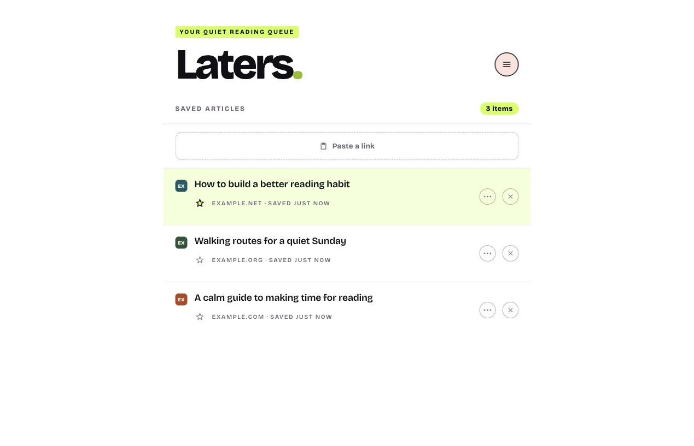
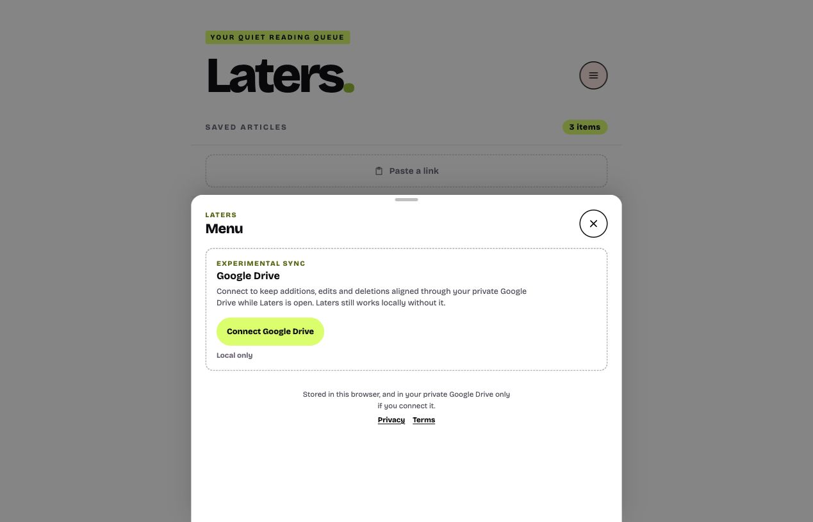

# Laters

A quiet place for articles you want to read later. Save a link on Android or paste one from any
browser, then return to a simple newest-first list when you have time.

**[Open Laters](https://laters.dustyb.in/)**



## Get started

1. Open [laters.dustyb.in](https://laters.dustyb.in/) in your browser.
2. Install it if you want app-like access. Use the **Install** action when Laters shows one, or your
   browser's **Install app** or **Add to Home screen** option.
3. On Android, share an article and choose **Laters**. On desktop or mobile, select **Paste a link**
   to add a copied or manually entered web address.
4. Open Laters whenever you want to read, bookmark or remove something from your queue.

You do not need an account. Your list starts in that browser and Laters continues to work without
Google Drive.

## Keep two devices aligned

Google Drive sync is optional and available to any Google Account.

1. Open the circular menu at the top right.
2. Select **Connect Google Drive**.
3. Choose the Google Account you want to use and approve the permission for Laters' own hidden
   application data.
4. Repeat on another device. Keep Laters open there when you want changes to arrive; a visible app
   checks Drive every 20 seconds.

Google currently labels the permission screen **dustyb.in**. Laters cannot see or alter your normal
Drive files, and the maintainer cannot see your reading list.



Closing, reloading or leaving Laters unused may end the short-lived Google session. Your local
changes remain safe: open the menu and use **Resume Google Drive** to continue syncing.

## Everyday controls

- Select an article title or the open space in its row to read the original page.
- Select the star to bookmark an article without moving it.
- Select **Show bookmarks** beside the list count to see only bookmarked articles, then **Show all**
  to return to the complete newest-first queue.
- Select **Delete** to remove an article; **Undo** remains available for seven seconds.
- On Android, swipe right to change the bookmark or left to reveal Delete.
- Long-press an article for Read, Edit title, Bookmark, Share and Delete. Sharing sends only its URL.
- On desktop, use the visible three-dot article control for the same menu.

## Choose an appearance

Open the circular menu and choose **System**, **Light** or **Dark** under **Appearance**. System is
the default and follows that device's current colour preference. A manual choice is saved only in
that browser: it is not included in Import, Export or Google Drive sync.

## Import or export your data

Open the circular menu and select **Import CSV** to add articles from a local CSV file. Laters accepts
its own export format and simpler spreadsheets containing a `url` column, with optional `title`,
`created`, `tags` and `readtime` columns. This means you can create an article list manually and put
an estimated reading time in `readtime` as an integer number of minutes, such as `4`. Blank values
are allowed. Laters does not calculate reading time from an article; when a valid value is supplied,
the list displays it as **≈ 4 min read**. Laters checks the complete file and shows a review before
changing anything.
Import adds only new URLs: it never replaces or deletes existing articles. Files are limited to
1,000 article rows and 10 MB. After a successful import, the menu closes and Laters shows the first
imported article in its saved-time position.

Open the circular menu and select **Download CSV** to create a CSV copy of the articles stored on that
device. The export contains article addresses, titles, saved times, optional reading-time estimates
and namespaced tags for bookmarks and deliberately edited titles. It can be opened as a spreadsheet
or used by tools that accept a CSV of links.

Your browser saves the file to its normal download location. Laters does not upload import or export
files. A connected import creates ordinary article additions that use the existing private Google
Drive sync. The complete column rules and a manual example are in the
[CSV import contract](docs/import-format.md).

## Disconnect or delete data

- **Stop syncing this browser:** open the menu and select **Disconnect**. Laters also asks Google to
  revoke the active permission, but does not delete data already stored in Drive.
- **Delete one article:** use its **Delete** control and let the Undo period finish. A connected
  device sends that deletion to Drive.
- **Delete local Laters data:** clear the site data for `laters.dustyb.in` in that browser. Do this
  only when you no longer need its local list or have confirmed another copy is safe.
- **Delete all hidden Drive data:** open [Google Drive settings](https://drive.google.com/drive/settings),
  find Laters under **Manage apps**, then choose **Delete hidden app data**.
- **Remove Google permission separately:** use your
  [Google Account permissions](https://myaccount.google.com/permissions).

Revoking permission alone may leave the hidden Drive data in place. The public
[privacy policy](https://laters.dustyb.in/privacy/) explains the exact storage and deletion boundary;
the hosted app also has plain-English [Terms](https://laters.dustyb.in/terms/).

## Privacy in brief

There is no Laters account, backend, advertising or analytics. Articles are stored locally in the
browser. Optional sync uses only Laters' private Google Drive application-data folder. Google access
tokens remain in page memory and are not saved to browser storage or Drive.

Laters tries to load the conventional favicon directly from each saved publisher. That request can
reveal your IP address and request timing to the publisher, but no central favicon service receives
your list or its source domains. Clearing browser data, storage eviction and some uninstall behaviour
can remove a local-only list. Use **Download CSV** when you want a separate CSV copy.

## For developers

Laters is a framework-free TypeScript PWA built with Vite 8. IndexedDB is the local source of truth,
the application shell works offline, and Android capture uses the Web Share Target API. The optional
Drive connection exchanges a base list and immutable add, edit, restore and delete operations. It
does not introduce a Laters backend or account system.

Laters treats article details, Android share data and Drive files as untrusted input. It accepts only
HTTP(S) article URLs, renders saved titles as text, bounds remote data, rejects website-generated
cross-site Share Target submissions and hides itself when framed. GitHub Pages cannot provide
project-defined HSTS, `X-Content-Type-Options`, `Permissions-Policy` or header-level
`frame-ancestors`; see [SECURITY.md](SECURITY.md) for the maintained limitations and reporting route.

```bash
npm ci
npm test
npm audit --audit-level=high
npm run typecheck
npm run audit:repository-privacy
npm run build
npm run audit:public-build
```

Project records: [MVP definition](docs/mvp-definition.md),
[MVP 2.0 definition](docs/mvp-2-definition.md),
[`v0.4.2` release](docs/releases/v0.4.2.md),
[`v0.5.0` release](docs/releases/v0.5.0.md),
[v0.5.7 public-readiness release](docs/releases/v0.5.7.md),
[v0.6.0 Export release](docs/releases/v0.6.0.md),
[v0.7.0 Import release](docs/releases/v0.7.0.md),
[`v0.8.0` dark-mode release](docs/releases/v0.8.0.md),
[`v1.0.0` completed personal-reading-queue release](docs/releases/v1.0.0.md),
[`v1.1.0` CSV reading-time candidate](docs/releases/v1.1.0.md),
[Google Drive live sync](docs/planning/google-drive-live-sync-plan.md),
[CSV export format](docs/export-format.md), [CSV import contract](docs/import-format.md),
[roadmap](docs/roadmap.md),
[current project truth](memory/now.md), and
[exploratory future ideas](docs/future-ideas.md).

## Licence

Laters is released under the [MIT Licence](LICENSE). Bricolage Grotesque is distributed separately
under the [SIL Open Font License 1.1](public/fonts/OFL.txt).
