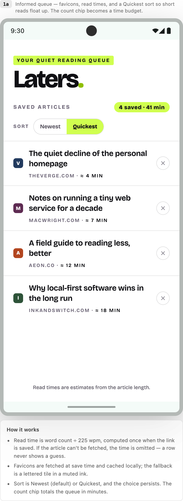
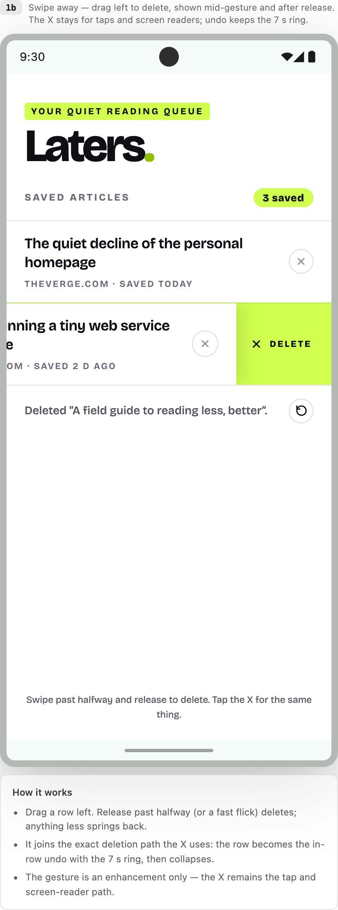
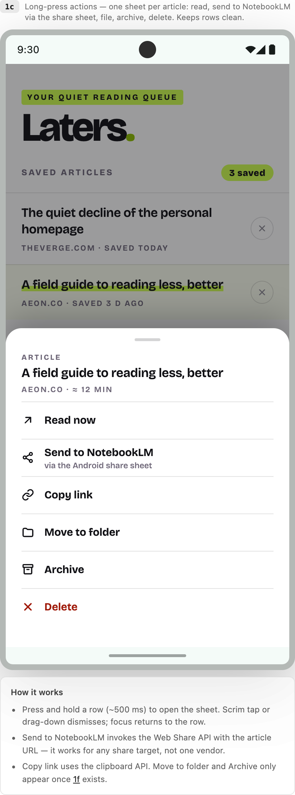
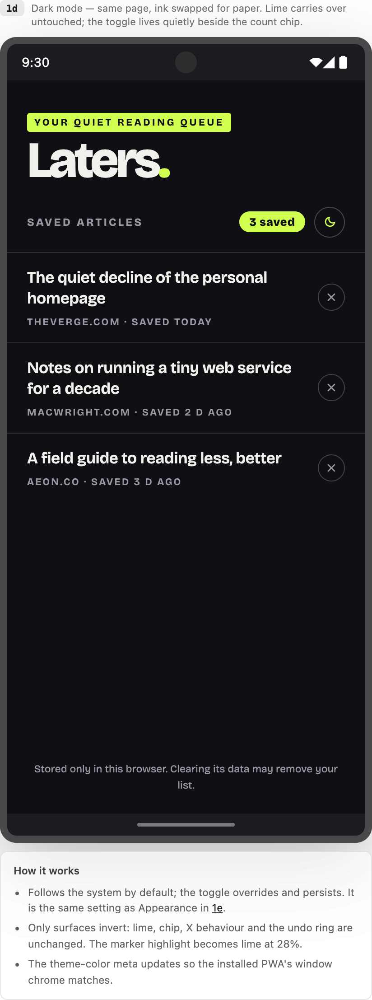
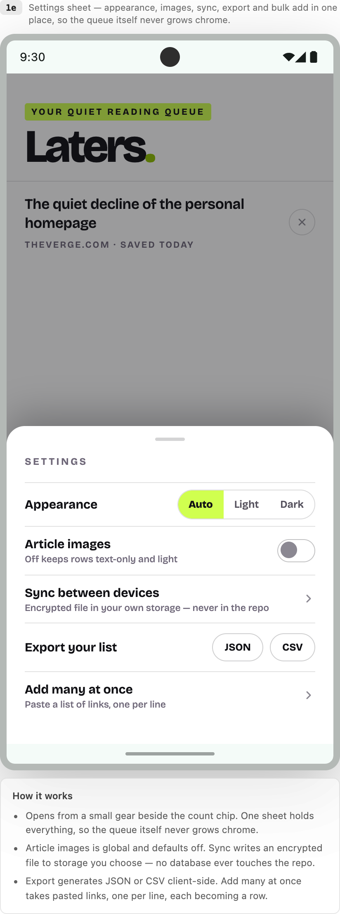
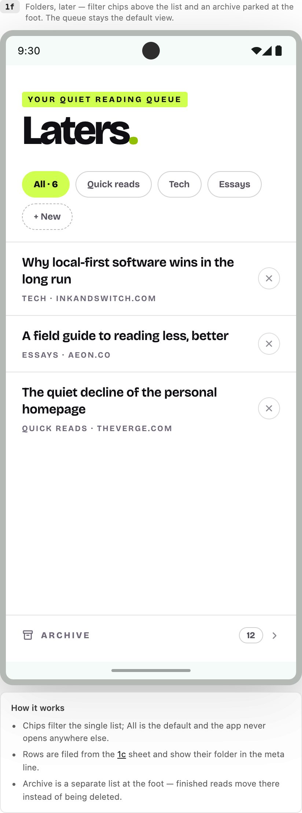
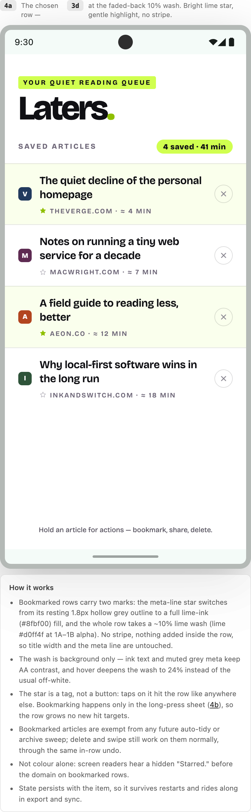
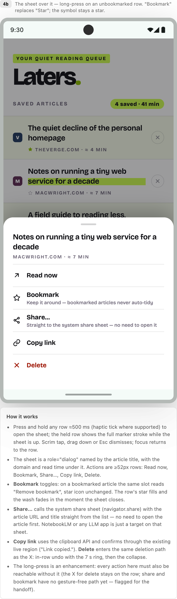

# Futures — per-screen functionality

> **Current status:** this file preserves the dated design exploration. Current behaviour is governed
> by [`../../memory/now.md`](../../memory/now.md), [`../../memory/intent.md`](../../memory/intent.md)
> and the relevant delivery records. In particular, the delivered **Share this article** action uses
> the generic system chooser with the URL only.

Companion to `Laters Futures.dc.html`. All type, colour, spacing and motion tokens are the
accepted MVP tokens ([`../2026-08-22 Claude MVP Handoff/01-visual-system.md`](../2026-08-22%20Claude%20MVP%20Handoff/01-visual-system.md)); this file only
specifies behaviour that is new.

Screens 4a and 4b were added after the original six. Their subtle lime bookmark wash is a
deliberate later exception to the earlier no-wash direction. For bookmarks, favicons and
whole-row opening, [`../mvp-2-definition.md`](../mvp-2-definition.md) now supersedes any
conflicting implementation assumption below.

The accepted MVP 2.0 row anatomy is favicon/fallback, title and Delete on the primary line,
then star, hostname and saved time on the metadata line. The hostname is not placed beside the
icon; it becomes the title only when the existing title-fallback rules require it.

---

## 1a — Informed queue

Favicons, read times, and a Quickest sort so short reads float up.

**Read time**
- Computed once at save time: visible word count ÷ 225 wpm, rounded to whole minutes, shown as "≈ N min".
- If the page cannot be fetched (CORS, offline, paywall), no time is stored and the meta line simply ends at the domain. Never estimate from the URL.
- Stored on the item, so the list never re-fetches.

**Favicon**
- MVP 2.0 tries the conventional `/favicon.ico` directly on the publisher origin. It does not
  fetch article HTML, use a central favicon service or require stored image data.
- Fallback: a 22px rounded tile with one or two hostname-derived characters and a colour from a
  fixed palette selected by a stable hostname hash. The same source therefore remains visually
  consistent rather than depending on neighbouring rows.
- Purely decorative: `aria-hidden="true"`, never the only source indicator (the domain stays in the meta line).

**Sort**
- Segmented control: Newest (default) / Quickest. Quickest sorts ascending by read time; items without a time sort last, newest first among themselves.
- Choice persists in localStorage. Sorting reorders in place — no animation beyond the standard row settle.
- The count chip becomes a budget: "4 saved · 41 min" (sum of known read times).

---

## 1b — Swipe away

A left-drag delete alongside the X, shown mid-gesture and after release.

- Pointer-driven: the row content translates with the finger; the revealed area is lime with an ink X and the word DELETE (word + icon, never colour alone).
- Commit: release past 50% of row width, or a flick past a velocity threshold. Otherwise the row springs back (spring, ~300 ms).
- On commit the row enters the **same deletion path as the X**: in-row "Deleted …" ghost, undo button with the 7 s draining ring, then the collapse. One code path, two entrances.
- Vertical scroll wins: the gesture only claims the pointer after ~12px of mostly-horizontal travel.
- Accessibility: the swipe is an enhancement. The X keeps its 44px hit area and `aria-label`; nothing is reachable only by gesture.

---

## 1c — Long-press actions

One bottom sheet per article: read, send to NotebookLM, copy, file, archive, delete.

- Open: press and hold a row ≈500 ms (haptic tick where supported). The row highlights with the full marker stroke while the sheet is up.
- Sheet: grabber, article title + domain + read time, then actions at ≥52px each:
  - **Read now** — opens the article (same as tapping the title).
  - **Send to NotebookLM** — `navigator.share({ url })`; the sub-label says "via the Android share sheet". Generic by design: any share target works.
  - **Copy link** — clipboard API, confirm via the existing live region ("Link copied.").
  - **Move to folder / Archive** — present only if 1f is adopted; otherwise omitted, not disabled.
  - **Delete** — error red, same deletion path as the X (in-row undo).
- Dismiss: scrim tap, drag down, or Esc. Focus is trapped in the sheet and returns to the row on close.
- The sheet is a `role="dialog"` with the article title as its accessible name.

---

## 1d — Dark mode

The same page with ink and paper swapped; lime carries over untouched.

- Default follows `prefers-color-scheme`; the header toggle overrides and persists. It is the same value as Appearance in 1e (Auto / Light / Dark).
- Surfaces: page `#101014`, text `#f2f0ec`, hairlines `rgba(255,255,255,.13)`, muted `#9a96a3`.
- Unchanged: lime `#d0ff4f` (AA against both inks), the chip, X hover-to-lime, the undo ring, all motion.
- The marker-pen title hover uses lime at 28% alpha so titles stay readable mid-stroke.
- The wordmark full stop turns lime (it is ink-on-white in light mode's #8fbf00 role; on dark, full lime reads correctly).
- `<meta name="theme-color">` switches with the theme so the installed window chrome follows.

---

## 1e — Settings sheet

Appearance, images, sync, export and bulk add in one place.

- Entry: a small gear beside the count chip (34px disc, 44px hit area). Everything configurable lives here; the queue itself never grows chrome.
- **Appearance** — Auto / Light / Dark segmented control (see 1d).
- **Article images** — global toggle, default off. On, rows may show a small thumbnail fetched at save time; off, rows are text-only and nothing is fetched.
- **Sync between devices** — writes an encrypted snapshot file to storage the user picks (Drive, iCloud, any synced folder). Passphrase-encrypted client-side; the repo never contains data, endpoints or credentials. Restoring on another device = pick the file, enter the passphrase.
- **Export your list** — JSON (full fidelity: url, title, saved-at, read time, folder) or CSV (spreadsheet-friendly). Generated client-side, downloaded directly.
- **Add many at once** — a textarea; paste links one per line. Each valid link becomes a row (saved-state announcement per batch, not per row); invalid lines are listed back, not silently dropped.

---

## 1f — Folders, later

Filter chips above the list, an archive parked at the foot.

- Chips: All (default, shows the count) plus user folders plus "+ New". Chips filter the single list; there is no folder "screen".
- Assignment happens in the 1c sheet; a filed row shows its folder as the first token of the meta line.
- **Archive** is not a folder: it is where finished reads go instead of deletion. One row at the foot of the page (count + chevron) opens it as the same list filtered to archived items, with Restore replacing the X.
- Deleting stays deleting — archive never intercepts the X or the swipe.
- The app always opens on All. Folders are never required; an unfiled list looks exactly like the MVP.

---

## 4a — Bookmarked rows

Starring ("bookmarking" in the UI) with a subtle row tag, on the full 1a queue (favicons + read times).

- Bookmarked rows carry two marks: the meta-line star switches from its resting hollow grey
  outline to the supplied bright-lime (`#d0ff4f`) fill with an ink outline, and the whole row
  takes a ~10% lime wash (lime `#d0ff4f` at 1A–1B alpha, maintainer-tuned). No stripe; nothing is
  added inside the row, so title width and the meta line are untouched.
- Every row shows the star — hollow at rest — so the bookmarked state reads as a change, not an addition.
- The wash is background only: ink text and muted grey meta keep AA contrast; hover deepens the wash to 24% lime instead of the usual off-white.
- The original exploration treated the star as a tag controlled only through 4b. MVP 2.0
  supersedes that interaction: the star is a direct accessible button with a 44px target until a
  gesture shell is deliberately selected.
- A quick tap on other non-interactive row space opens the article. The Star and Delete buttons
  never trigger row opening; the title remains the semantic link and keyboard path.
- Bookmarked articles are exempt from any future auto-tidy or archive sweep; delete and swipe still work on them normally, through the same in-row undo.
- Not colour alone: a visually hidden "Starred." precedes the domain for screen readers.
- Bookmark state persists on the item, survives restarts, and rides along in export and sync.

---

## 4b — Long-press sheet

Per-article actions without adding any chrome to the row: bookmark and share directly from the list.

- Open: press and hold a row ≈500 ms (haptic tick where supported). The held row shows the full marker stroke while the sheet is up. Scrim tap, drag down, or Esc dismisses; focus returns to the row.
- The sheet is a `role="dialog"` named by the article title, with domain and read time beneath. Actions are ≥52px rows:
  - **Read now** — opens the article (same as tapping the title).
  - **Bookmark** — star symbol, word "Bookmark". Toggles: on a bookmarked article the same slot reads "Remove bookmark", icon unchanged. The row's star fills and the wash fades in the moment the sheet closes.
  - **Share this article** — the system share sheet (`navigator.share`) with the article URL only, straight from the list. NotebookLM or any other compatible app is just a target on that sheet; no vendor SDK or API key.
  - **Copy link** — clipboard API, confirmed via the existing live region ("Link copied.").
  - **Delete** — error red, same deletion path as the X: in-row undo with the 7 s ring, then the collapse.
- Bookmark and Delete retain their visible star and X paths. The maintainer explicitly accepted
  Share as a long-press-only exception for this personal app; it was published after the `v0.3.0`
  interaction shell and shares only the URL.
